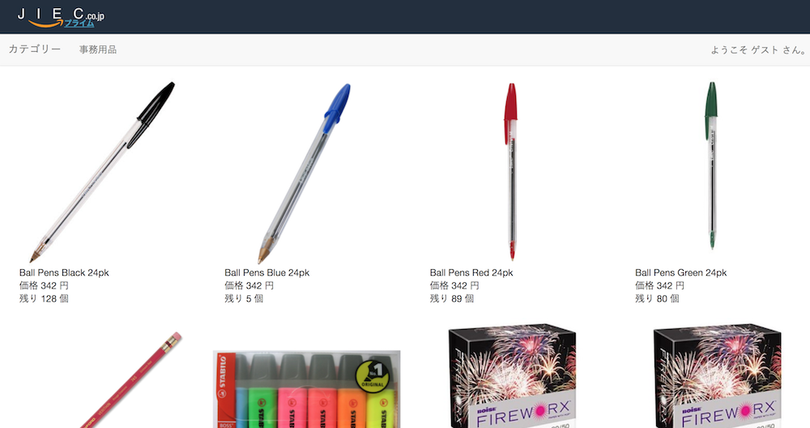
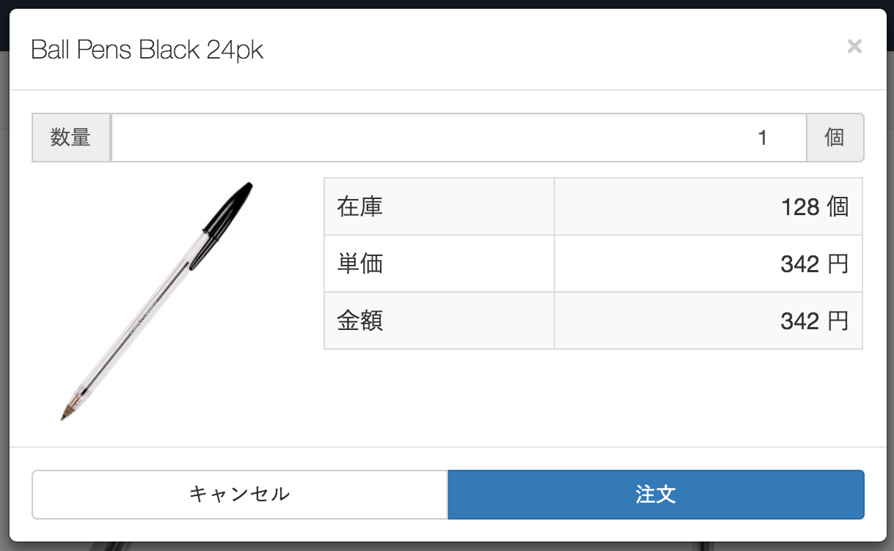
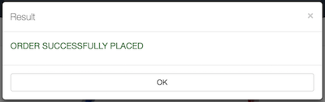

# Office Supplies  

## はじめに
「JIEC の API ソリューション」のデモアプリは次の3層構造になっています。  

1. On-premise RD&T zConnect
1. Bluemix API Connect
1. Bluemixフロントエンド

本アプリは3層中の一つである「Bluemix フロントエンド」です。

## 実行手順
### 前提条件
* 3層アプリが全て稼働していること。(基本的に常時稼働しています。)

### トップページにアクセスする
* 次のURLにアクセスしてください。(Amazon.co.jp に似たデザインのページが表示されます。)  
  https://jiec-prime.mybluemix.net/  
    

### 注文する
* アイテムをクリックすると注文ダイアログが表示されます。  
    
* 数量を入力して、注文ボタンをクリックしてください。次の結果が表示されます。(数量は1〜在庫数または999個まで)  
    
 

## ファイル構成  
    office-supplies
    │  .cfignore
    │  .gitignore
    │  app.js                 アプリ
    │  package.json
    │  README.md
    │
    ├─models
    │      office-supply.js   モデル
    │
    ├─public
    │      images/            画像ファイル
    │      favicon.ico
    │      index.js           クライアント JavaScript
    │      mybootstrap.css
    │      
    ├─routes
    │      index.js           ルーティング
    │      
    ├─utils
    │      context.js         コンテキスト
    │      
    └─views
           index.ejs          画面

## ルート (URLマッピング)
|Action|Method|処理|
|---|-----------|-----------|
|/|GET|事務用品一覧ページを表示する。|
|/item/:id|GET|事務用品詳細を取得して結果(JSON)を返す。|
|/item/order|POST|事務用品をオーダーして結果(JSON)を返す。{id, number}|
