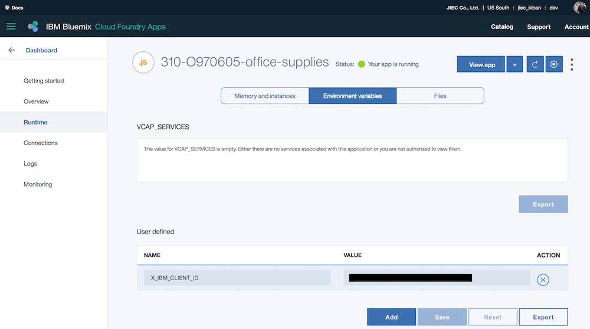

# Office Supplies  

## はじめに
「JIEC の API ソリューション」のデモアプリは次の3層構造になっています。  

1. On-premise RD&T zConnect
1. Bluemix API Connect
1. Bluemixフロントエンド

本アプリは3層中の一つである「Bluemix フロントエンド」です。

## 実行手順
### 前提条件
* 3層アプリが全て稼働していること。(基本的に常時稼働しています。)

### トップページにアクセスする
* 次のURLにアクセスしてください。(Amazon.co.jp に似たデザインのページが表示されます。)  
  https://jiec-prime.mybluemix.net/  
    

### 注文する
* アイテムをクリックすると注文ダイアログが表示されます。  
    
* 数量を入力して、注文ボタンをクリックしてください。次の結果が表示されます。(数量は1〜在庫数または999個まで)  
    
* OKボタンをクリックしてください。トップページに戻ります。   

## Bluemix API Connect
本アプリから呼出している Bluemix API Connect 層のAPIを以下に示します。

1. 一覧をリストするAPI
  
        GET  
        https://api.us.apiconnect.ibmcloud.com/jieckiban-demo/office/catalogMgr/listCatalog?startItemID={開始商品番号}

1. 商品詳細の照会API

        GET
        https://api.us.apiconnect.ibmcloud.com/jieckiban-demo/office/catalogMgr/getItemDetails/{商品番号}
  
1. オーダーAPI

        POST
        https://api.us.apiconnect.ibmcloud.com/jieckiban-demo/office/catalogMgr/orderItem
        
        次のBody(JSON形式)が必要です。
        {
          "DFH0XCMNOperation": {
            "ca_order_request":{
              "ca_quantity_req": 注文個数,
              "ca_item_ref_number": 商品番号
            }
          }
        }

    > ３つのAPIとも、実行できるアプリケーションを特定しているので、ヘッダーにクライアントID (x-ibm-client-id) が必要です。IDが必要な方はお問い合わせください。

## セットアップ  
独自の実行環境をセットアップする手順を以下に示します。利用するだけであれば、前述の実行手順をご覧ください。  

1. 本サイトから office-supplies アプリをダウンロード (Download ZIP) して解凍してください。ディレクトリ名は office-supplies-master から office-supplies に変更してください。  

1. Bluemix コンソールから CFアプリケーション (Node.js) を作成してください。以下の ippei0605 はご自身のユーザ名などに変更してください。  
アプリケーション名: office-supplies-ippei0605 (任意)  

1. Bluemix コンソールから CF アプリの環境変数 (ユーザー定義) を設定します。次の変数を設定してください。
      * X_IBM_CLIENT_ID : クライアントID　　
        

1. 解凍したディレクトリ (office-supplies アプリのホーム) に移動してください。

        > cd office-supplies

1. Bluemix に接続してください。

        > bluemix api https://api.ng.bluemix.net
    
1. Bluemix にログインしてください。

        > bluemix login -u ippei0605@gmail.com -o jiec_kiban -s dev

1. アプリをデプロイしてください。

        > cf push "office-supplies-ippei0605"

## ファイル構成  
    office-supplies
    │  .cfignore
    │  .gitignore
    │  app.js                 アプリ
    │  package.json
    │  README.md
    │
    ├─docs
    │      env.png            README.md の図
    │      order.png          README.md の図
    │      result.png         README.md の図
    │      top.png            README.md の図
    │
    ├─models
    │      office-supply.js   モデル
    │
    ├─public
    │      images/            画像ファイル
    │      favicon.ico
    │      index.js           クライアント JavaScript
    │      mybootstrap.css
    │      
    ├─routes
    │      index.js           ルーティング
    │      
    ├─utils
    │      context.js         コンテキスト
    │      
    └─views
           index.ejs          画面

## ルート (URLマッピング)
|Action|Method|処理|
|---|-----------|-----------|
|/|GET|事務用品一覧ページを表示する。|
|/item/:id|GET|事務用品詳細を取得して結果(JSON)を返す。 (APIとして作成しましたが、一覧で全ての項目が取得できるため画面から呼出していません。)|
|/item/order|POST|事務用品をオーダーして結果(JSON)を返す。{id, number}|

## まとめ
* API の配置に関する考察をするか・・・

## 参考文献
* z/OS Connect Enterprise Edition V2.0  
  https://www-03.ibm.com/support/techdocs/atsmastr.nsf/WebIndex/WP102604  
  - [Getting Started Guide](https://www-03.ibm.com/support/techdocs/atsmastr.nsf/5cb5ed706d254a8186256c71006d2e0a/ef7025c4a674ca4a86257f0d00725591/$FILE/WP102604%20-%20zOS%20Connect%20EE%20V2%20Getting%20Started.002.pdf/WP102604%20-%20zOS%20Connect%20EE%20V2%20Getting%20Started.pdf)
* IBM デモサイト  
  https://officesupplies.mybluemix.net/  
  (JeanLeclerc/jean)  
